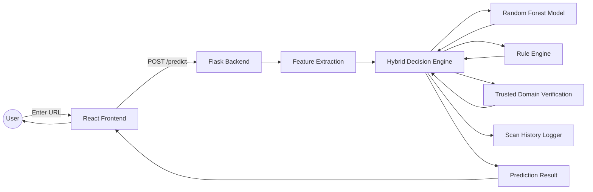

## 🛡️ Project Description

Phishing attacks are among the most common cybersecurity threats, often leading to credential theft, financial fraud, and data breaches. As attackers continue to develop more sophisticated phishing techniques, traditional detection methods may not always be sufficient. This project aims to leverage Machine Learning and Cybersecurity techniques to identify phishing websites and improve online security through automated detection.

---

# ✨ Features

- 🤖 Machine Learning based phishing detection
- 🛡️ Hybrid Decision Engine combining AI and Rule-Based Analysis
- ✅ Trusted Domain Whitelist Verification
- 🔍 URL Feature Extraction
- 📊 Confidence Score Prediction
- 🚨 Risk Classification (Low / Medium / High)
- 📝 Scan History Logging
- ⚡ RESTful Flask API
- 🌐 Modern React Frontend
- 📦 Modular Project Architecture
- 🚀 Deployment Ready (Render + Vercel)

---

# 🏗️ System Architecture

The framework follows a modular client-server architecture designed for efficient phishing URL detection.



---

# 🔍 Detection Workflow

The phishing detection process follows these stages:

1. User enters a URL through the React frontend.
2. Flask backend receives the request.
3. URL lexical features are extracted.
4. Random Forest predicts the URL class.
5. Rule Engine evaluates suspicious URL characteristics.
6. Trusted Domain Verification checks known safe domains.
7. Hybrid Decision Engine combines all results.
8. Scan history is logged.
9. Final prediction is returned to the frontend.

---

# 📂 Project Structure

```text
AI-Based-Phishing-Detection-Framework/
├── README.md                      # Main project overview and banner
│
├── 📁 Frontend/
│   ├── 📁 public/                 # Static assets served by the React application
│   ├── 📁 src/                    # React source code and UI components
│   ├── README.md                  # Frontend setup and usage guide
│   ├── .gitignore                 # Git ignore rules for frontend
│   ├── package.json               # Frontend dependencies and npm scripts
│   └── package-lock.json          # Locked dependency versions
│
├── 📁 Backend/
│   ├── 📁 data/                   # Datasets, processed data, and scan history
│   ├── 📁 models/                 # Trained machine learning models
│   ├── 📁 reports/                # Model evaluation reports and figures
│   ├── 📁 src/                    # Flask backend source code
│   ├── requirements.txt           # Python dependencies
│   ├── Procfile                   # Render deployment configuration
│   ├── .env.example               # Environment variable template
│   └── README.md                  # Backend documentation
│
├── 📁 reports/
│   ├── 📁 evaluation/
│   ├── 📁 figures/
│   └── README.md
│
├── 📁 data/
│   ├── 📁 raw/
│   ├── 📁 processed/
│   ├── 📁 history/
│   ├── data_schema_design.txt
│   └── README.md
│
├── 📁 docs/
│   ├── API_SPEC.md
│   └── ARCHITECTURE.md
│
├── 📁 models/
│   ├── phishing_detector.pkl
│   └── feature_columns.pkl
│
├── 📁 src/
│   ├── app.py
│   ├── decision_engine.py
│   ├── feature_extraction.py
│   ├── rule_engine.py
│   ├── trusted_domains.py
│   ├── logger.py
│   ├── model_loader.py
│   ├── prediction.py
│   ├── train_model.py
│   ├── evaluate_model.py
│   ├── data_collection.py
│   ├── data_processing.py
│   ├── data_storage.py
│   ├── dataset_builder.py
│   ├── reputation_checker.py
│   ├── utils.py
│   ├── config.py
│   ├── test_prediction.py
│   ├── test_decision_engine.py
│   └── README.md
│
├── 📁 deployment/
│   └── README.md
```

---

# 🛠️ Tech Stack

### Frontend

- React
- Vite
- JavaScript
- CSS3
- Axios

### Backend

- Flask
- Flask-CORS

### Machine Learning

- Scikit-learn
- Random Forest Classifier
- Pandas
- NumPy
- Joblib

### Tools

- Git
- GitHub
- Render
- Vercel

---

# 🧠 Machine Learning Pipeline

The phishing detection model follows a structured machine learning workflow.

### Dataset Collection

- Phishing URLs
- Legitimate URLs

### Data Preprocessing

- Cleaning
- Duplicate Removal
- Feature Engineering
- Data Validation

### Feature Extraction

The model extracts lexical URL features including:

- URL Length
- Domain Length
- Path Length
- Query Length
- Number of Dots
- Number of Hyphens
- Number of Digits
- Number of Special Characters
- HTTPS Usage
- Presence of IP Address
- URL Entropy
- Suspicious Keywords
- Tiny URL Detection
- Redirection Detection
- Subdomains
- Prefix/Suffix Detection

### Model

- Random Forest Classifier

### Additional Detection Layers

- Rule-Based Engine
- Trusted Domain Whitelist
- Risk Assessment Engine

---

# 🚀 Getting Started

## Prerequisites

Make sure the following software is installed on your system:

- Python 3.10+
- Node.js (v18 or later)
- npm
- Git

---

## 1️⃣ Clone the Repository

```bash
git clone https://github.com/your-username/AI-Based-Phishing-Detection-Framework.git
cd AI-Based-Phishing-Detection-Framework
```

---

## 2️⃣ Backend Setup

Navigate to the backend directory:

```bash
cd Backend
```

Create a virtual environment.

### Windows

```bash
python -m venv .venv
```

Activate it:

```bash
.venv\Scripts\activate
```

### Linux / macOS

```bash
python3 -m venv .venv
source .venv/bin/activate
```

Install the required dependencies:

```bash
pip install -r requirements.txt
```

---

## 3️⃣ Start the Flask Backend

Navigate to the source directory:

```bash
cd src
```

Run the backend server:

```bash
python app.py
```

The backend API will start at:

```
http://127.0.0.1:5000
```

You can verify that it is running by opening:

```
http://127.0.0.1:5000
```

Expected response:

```json
{
    "message":"AI-Based Phishing Detection Backend",
    "status":"Running"
}
```

---

## 4️⃣ Frontend Setup

Open **another terminal**.

Navigate to the frontend folder:

```bash
cd Frontend
```

Install the required Node packages:

```bash
npm install
```

Start the React development server:

```bash
npm run dev
```

The frontend will start at:

```
http://localhost:5173
```

---

## 5️⃣ Using the Application

Ensure **both servers are running simultaneously.**

| Terminal | Command |
|----------|---------|
| Terminal 1 | `python app.py` |
| Terminal 2 | `npm run dev` |

Open your browser and visit:

```
http://localhost:5173
```

Enter a URL (for example):

```
https://google.com
```

Click **Analyze URL** to receive:

- Prediction
- Confidence Score
- Risk Level
- Trusted Domain Status
- Detection Reasons

---

# 🧪 API Endpoints

| Method | Endpoint | Description |
|---------|----------|-------------|
| GET | `/` | Backend status |
| GET | `/health` | Health check |
| POST | `/predict` | Analyze a URL |

---

## Example Request

```json
{
    "url":"https://google.com"
}
```

---

## Example Response

```json
{
    "prediction":"LEGITIMATE",
    "confidence":99.0,
    "risk":"LOW",
    "trusted":true,
    "rule_score":0,
    "reasons":[
        "Trusted domain - safe override"
    ]
}
```

---

# 🧪 Running Tests

Navigate to the backend source directory:

```bash
cd Backend/src
```

Run the prediction tests:

```bash
python test_prediction.py
```

Run the decision engine tests:

```bash
python test_decision_engine.py
```


# 👨‍💻 Contributors

- **Anvita Hadkar**
- **Pranjali Mahadik**
- **Siddhi Gudhekar**

---

# 📄 License

This project is intended for educational, research, and cybersecurity learning purposes.

```
MIT License
```
