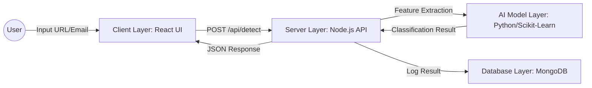

# System Architecture: AI-Based Phishing Detection Framework

## 1. Architecture Diagram
The system follows a modular, decoupled client-server architecture designed for scalability and low-latency analysis.

## 2. Component Explanation

A. Client Layer (Frontend)
The interface is designed for minimal user friction. It captures inputs, sends them to the server via asynchronous HTTP requests, and visualizes the AI’s classification result (e.g., "Legitimate" or "Phishing") with appropriate UI feedback (e.g., color-coded status, loading spinners).

B. Server Layer (Backend)
The backend acts as the central orchestrator. It is responsible for:

Request Validation: Sanitizing inputs to prevent injection attacks.

API Management: Handling routes as defined in docs/API_SPEC.md.

Model Orchestration: Acting as the middleware that calls the AI model and returns processed results to the client.

C. AI Model Layer (Detection Engine)
This is the core intelligence of the framework. It processes the input features against a trained machine learning model. It is designed to be modular, allowing for future updates to the classification algorithms without requiring changes to the frontend or database layers.

D. Database Layer (Persistence)
This layer ensures data consistency and traceability. It logs every detection request, including timestamp, input data, and the classification result, facilitating system auditing and continuous performance monitoring.
