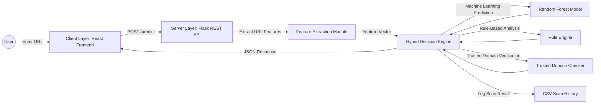

# 🏗️ System Architecture

## AI-Based Phishing Detection Framework

This document describes the overall architecture of the **AI-Based Phishing Detection Framework**. The system follows a modular, decoupled client-server architecture that integrates a React frontend, a Flask backend, and a hybrid phishing detection engine to provide accurate and efficient URL analysis.

---

# 🌐 Architecture Diagram



---

# 📖 Architecture Overview

The system follows a modular, decoupled client-server architecture designed for scalability, maintainability, and low-latency phishing URL detection.

The frontend communicates with the backend through RESTful APIs. The backend performs feature extraction, executes a hybrid phishing detection engine combining machine learning and rule-based analysis, logs scan history, and returns structured JSON responses to the client.

---

# 🧩 Component Explanation

## A. Client Layer (Frontend)

**Technology:** React, Vite, JavaScript, CSS

The frontend provides an intuitive and responsive user interface for phishing URL analysis.

Its responsibilities include:

- Accepting URL input from users.
- Sending asynchronous HTTP POST requests to the backend.
- Displaying loading indicators while analysis is in progress.
- Presenting prediction results.
- Showing confidence score and risk level.
- Displaying trusted domain status.
- Explaining the reasons behind the prediction.

The frontend remains completely independent of the machine learning implementation and communicates solely through REST API endpoints.

---

## B. Server Layer (Backend)

**Technology:** Flask, Flask-CORS

The backend acts as the central controller of the application.

Its responsibilities include:

- Validating incoming requests.
- Processing JSON payloads.
- Managing REST API endpoints.
- Invoking the feature extraction module.
- Calling the hybrid decision engine.
- Logging prediction results.
- Returning structured JSON responses to the frontend.

### REST API Endpoints

| Method | Endpoint | Purpose |
|---------|----------|---------|
| GET | `/` | Returns API information and server status |
| GET | `/health` | Performs a backend health check |
| POST | `/predict` | Performs phishing URL detection |

---

## C. Feature Extraction Layer

**Technology:** Python

This module converts a raw URL into a structured feature vector suitable for machine learning inference.

Examples of extracted features include:

- URL Length
- Domain Length
- HTTPS Presence
- Number of Dots
- Special Characters
- Suspicious Keywords
- IP Address Detection
- URL Shortener Detection
- Additional engineered URL characteristics

The extracted feature vector is passed to the Hybrid Decision Engine.

---

## D. Hybrid Decision Engine

**Technology:** Scikit-learn, Rule-Based Detection

The Hybrid Decision Engine forms the core intelligence of the framework.

Rather than relying solely on machine learning, it combines multiple detection mechanisms.

### Machine Learning Model

Uses a trained Random Forest classifier to predict whether a URL is legitimate or phishing based on extracted features.

### Rule Engine

Applies predefined cybersecurity heuristics to identify suspicious URL characteristics such as:

- Excessively long URLs
- Multiple subdomains
- Suspicious symbols
- URL shortening services
- Presence of IP addresses
- Other known phishing indicators

### Trusted Domain Verification

Checks whether the submitted domain belongs to a predefined trusted whitelist.

Trusted domains may safely override machine learning predictions when appropriate.

The outputs from all three modules are combined to produce:

- Prediction
- Confidence Score
- Risk Level
- Detection Reasons

---

## E. Logging Layer

Every prediction request is recorded for auditing and future analysis.

Each log entry contains:

- Timestamp
- URL
- Prediction
- Confidence Score
- Risk Level
- Trusted Status
- Rule Score

The scan history is stored in:

```
data/history/scan_history.csv
```

This logging mechanism improves traceability, debugging, and future model evaluation.

---

# 🔄 System Workflow

The complete request lifecycle is shown below.

```text
User
   │
   ▼
React Frontend
   │
   ▼
POST /predict
   │
   ▼
Flask Backend
   │
   ▼
Request Validation
   │
   ▼
Feature Extraction
   │
   ▼
Hybrid Decision Engine
   ├──────────────┬──────────────┐
   ▼              ▼              ▼
Machine      Rule Engine   Trusted Domains
Learning
   │
   └──────────────┬──────────────┘
                  ▼
         Final Prediction
                  │
                  ▼
          Log Scan History
                  │
                  ▼
        JSON Response Returned
                  │
                  ▼
          React Frontend UI
```

---

# 🏛️ Architectural Principles

The framework is designed around the following software engineering principles.

## Modularity

Each component is implemented independently, allowing easier maintenance and future upgrades.

---

## Separation of Concerns

Frontend, backend, feature extraction, machine learning, rule engine, and logging are separated into dedicated modules with clearly defined responsibilities.

---

## Scalability

The modular architecture enables new machine learning models, additional detection techniques, or frontend enhancements to be incorporated without affecting existing components.

---

## Maintainability

A structured directory hierarchy and modular implementation simplify debugging, testing, and collaborative development.

---

## Extensibility

The framework can be extended to support:

- Browser extensions
- Email phishing detection
- Cloud database integration
- Threat intelligence APIs
- Additional machine learning models
- User authentication and scan history dashboards

---

# 📂 Architectural Layers

| Layer | Technology | Responsibility |
|---------|------------|----------------|
| Client Layer | React, Vite | User Interface |
| Backend Layer | Flask | REST API & Request Processing |
| Feature Extraction Layer | Python | URL Feature Engineering |
| Detection Engine | Random Forest + Rule Engine | Phishing Classification |
| Trusted Domain Layer | Python | Trusted Domain Verification |
| Logging Layer | CSV | Scan History & Audit Trail |

---

# 📌 Summary

The AI-Based Phishing Detection Framework adopts a modular client-server architecture that integrates machine learning, rule-based detection, and trusted domain verification to accurately classify URLs as legitimate or phishing. By separating the frontend, backend, feature extraction, and detection engine into independent layers, the system remains scalable, maintainable, and easy to extend for future cybersecurity applications.
